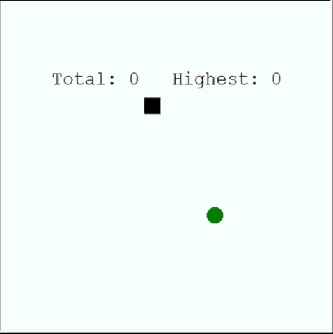
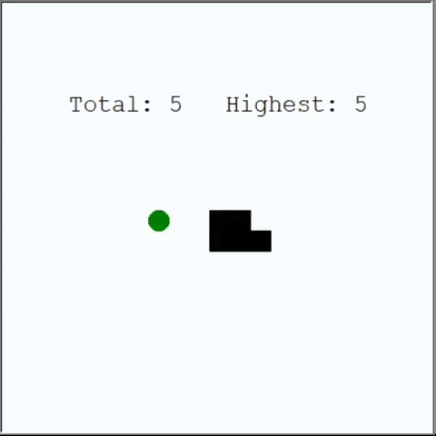
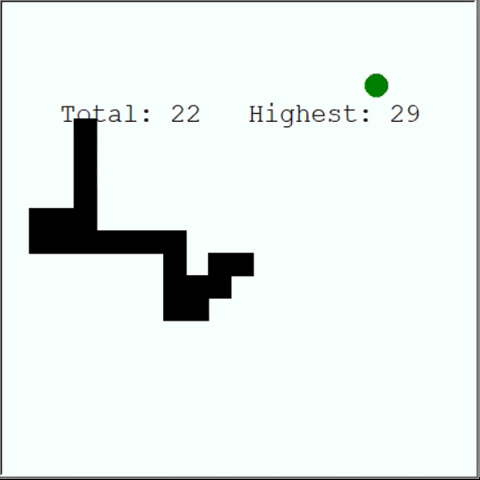

# DQN Agent Snake Game

This project contains the four main files:
1. **snake_env.py** : Run this and you can play the game Snake by yourself
2. **agent_1.py** : Run this and a Deep Reinforcement Learning Agent will learn to play snake
3. **plot_script.py** : Plotting the results of the agent
4. **requirements.txt** : You will need some Python packages, like turtle, TensorFlow and Keras before you can run the scripts, install these first

## Having a close look at Agent

1. The first games, the agent has no clue:

2. End of game 13 and beginning of game 14:
The agent learns, it doesn’t take the shortest path but finds his way to the apples.

3. Game 30:
The agent avoids the body of the snake and finds a fast way to the apples, after playing only 30 games.

### Issues & Suggestions
If any issues and suggestions to me, you can create an [issue](https://github.com/Siddhant-Agarwal4583/DQN_Agent_Snake_Game/issues).
